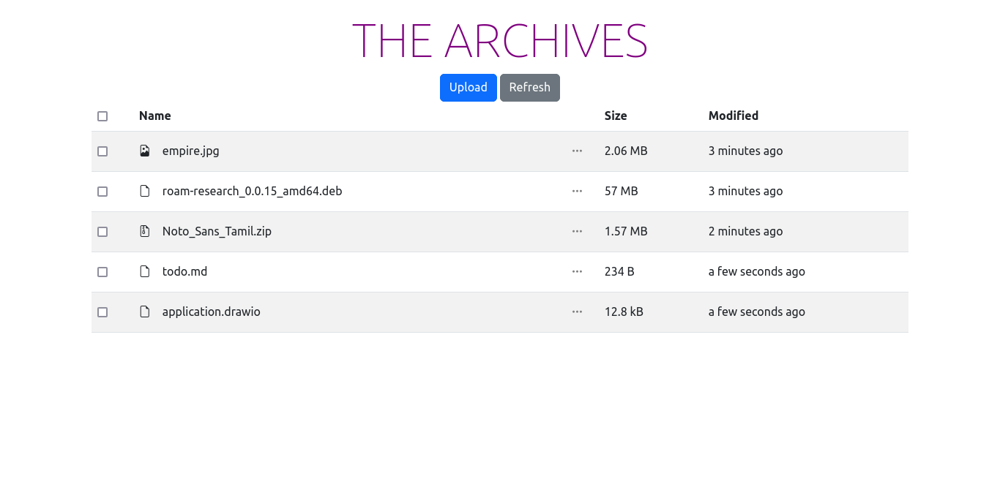
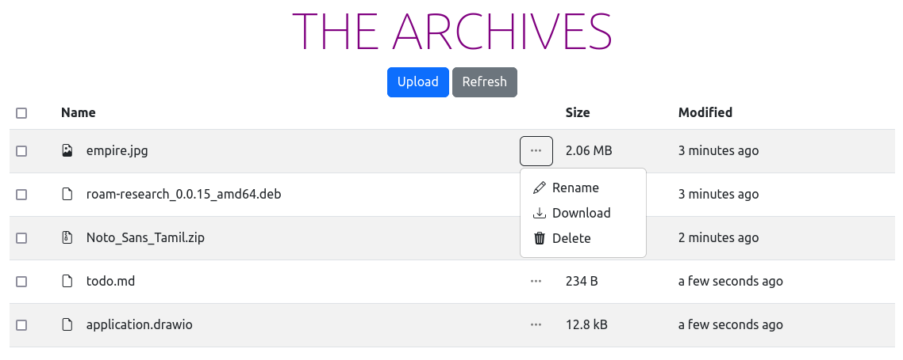
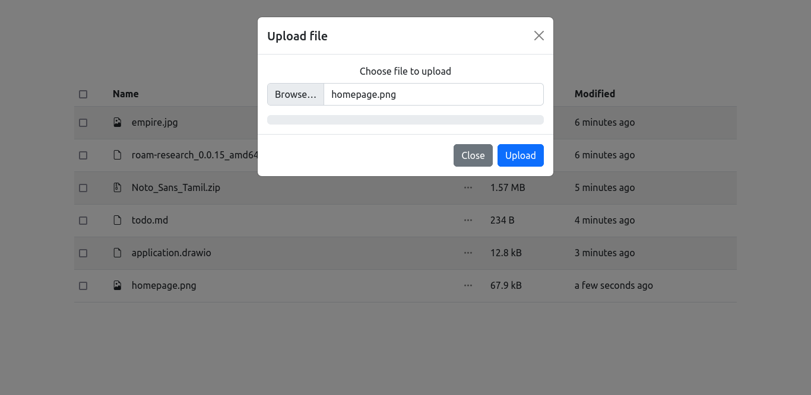

# The Archives

A file storage server built using [Svelte](https://svelte.dev/) and mainly [Bootstrap](https://getbootstrap.com/) components and icons on the frontend, [Go](https://go.dev/), the [Gin](https://github.com/gin-gonic/gin) HTTP web framework, and [GORM](https://gorm.io/) as ORM on the backend.

Uses [PostgreSQL](https://www.postgresql.org/) as Database, and [Minio](https://min.io/) for S3-compatible Storage.

### Homepage

### File options

### Upload dialog

## Setup
- Set up configuraiton for frontend and backend in `frontend/src/config.js` and `backend/config/config.go` respectively.

## Features

-   [x] File Upload
-   [x] Upload Progress
-   [x] File Download
-   [x] Healthcheck endpoint
-   [ ] Implement Multi Select in File List
-   [ ] User Registration
-   [ ] User Login
-   [ ] Add Setup Procedures
-   [ ] Organize frontend codebase
-   [ ] Dockerfile for frontend
-   [ ] Docker Compose for backend and frontend
-   [ ] Image Preview
-   [ ] Deploy to Vercel
-   [ ] Add Github Actions pipeline for deployment
